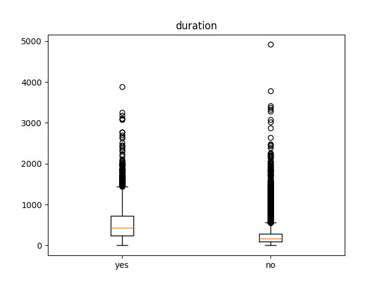
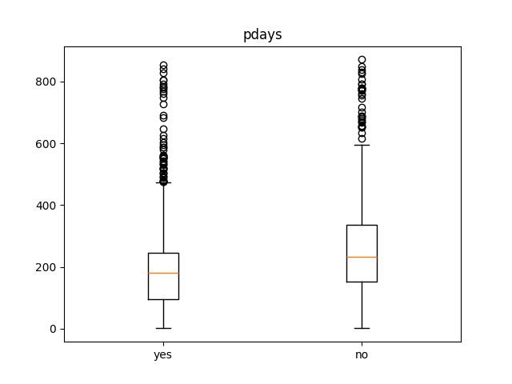
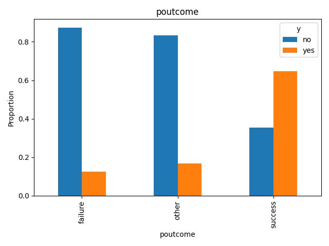

# Term deposit prediction

---

## Project Overview & Analysis

A machine learning project predicting customer subscription to term deposits, with EDA, model selection, hyperparameter optimization
and threshold-based evaluation of performance.

### EDA Insights

The used data is part of a marketing dataset of a Portuguese bank and automatically loaded. [^1] This repository itself provides no data.

#### Numerical Features

The feature `balance` shows a very wide distribution and is strongly right-skewed but likely has low predictive power. The feature `duration` exhibits better discrimination, 
however, call duration is only known after the call, which would make its inclusion unrealistic. Therefore, duration is removed before training.
The cleaned feature `pdays` indicates that customers contacted more recently tend to accept the offer more often. However, no practical preprocessing allows its meaningful 
inclusion, so it is removed as well.

<div style="display: flex; justify-content: center; align-items: center; gap: 20px">
    
    
</div>

The features `age`, `day_of_week`, `campaign` and `previous` show no remarkable patterns.

#### Categorical Features
The dataset reveals that subscription rates are higher for customers who are students or retired than other categories of the `job` feature. The feature `month` also shows notable 
discrepancies: in March, October, September, and December, the proportion of positive responses is significantly higher than in other months. The feature `poutcome` highlights retention, 
as more than 60% of customers with previous successful campaigns accept the offer again.

<div style="display: flex; justify-content: center; align-items: center; gap: 20px">
    
    
</div>

The other categorical features `marital`, `education`, `default`, `housing`, `loan` and `contact` show no substantial differences between categories.

The target variable is unbalanced as only 11.69% of cases have a `yes` result. The consequence is that the Accuracy is distorted and PR-AUC is more meaningful because the performance of the
positive class is explicitly measured.

---

### Target Metric

The primary target metric is Precision because false positives are costly in term deposit prediction, whereas false negatives represent only opportunity costs. High false positives 
increase costs without generating revenue, while false negatives are less critical. Additionally, ROC-AUC and PR-AUC are used during model selection because they allow comparison of 
models independent of any threshold.

---

### Model Selection

Since this is a classification problem, the candidate models include Logistic Regression, Naive Bayes, k-Nearest Neighbors, SVM, Random Forest, and Gradient Boosting Classifier.
Among these, GBC achieves the best baseline performance with a ROC-AUC of 0.789 and Precision of 0.641, making it the model selected for further optimization.
Hyperparameters were tuned using GridSearchCV on the training set. Structural parameters (`max_depth`, `min_samples_split`) were explored on a coarse grid, while optimization-related 
parameters (`learning_rate`, `n_estimators`, `subsample`) were fine-tuned in a second pass:

`max_depth`: 4  
`min_samples_split`: 3  
`learning_rate`: 0.04  
`n_estimators`: 350  
`subsample`: 0.75

---

### Performance

Model performance depends on the chosen decision threshold. Given the priority on Precision, the optimal threshold lies around 0.6.

| Threshold |  0.5  |  0.6  |  0.7  |
|-----------|:-----:|:-----:|:-----:|
| Precision | 0.654 | 0.712 | 0.750 |
| Recall    | 0.255 | 0.175 | 0.111 | 

The threshold should be chosen considering the cost per call and revenue per successful subscription, balancing opportunity costs and wasted effort. The model in its current form is 
suitable for decision support, but the threshold should ideally be adapted to real-world cost/revenue data.

---

### Further Work

Additional features could improve prediction, such as account deposit/withdrawal frequency. Customers with volatile balances may accept term deposit offers less frequently, while those 
already using the account as a term deposit might be more likely to subscribe. Other potential variables include economic conditions or competitors’ interest rates: if the offered rate 
is attractive relative to inflation or other banks, subscription rates may increase, otherwise, they may decrease. The cost per call and profit per customer could also be incorporated 
into threshold selection.

The model could be adapted for other banking products by adjusting the target variable and retraining. Some features may lose relevance, and a requirement is that the new target variable is
collected from the same customers or all features are selected for new customers. The previous target could even serve as a new feature.


## Installation and Usage

This project requires **Python >= 3.9.6**. Clone the repository and install dependencies:

```bash
git clone https://github.com/felix-friedmann/term_deposit_prediction.git
cd term_deposit_prediction

# Optional: use a venv for isolation
python -m venv venv
source venv/bin/activate # Linux/Mac
venv\Scripts\activate    # Windows

pip install -r requirements.txt
```

### Usage

The main script allows you to run EDA, model testing or HPO and threshold evaluation for one of the candidate models:  
`lr`: Logistic Regression  
`nb`: Naive Bayes  
`knn`: k-Nearest Neighbors  
`svm`: SVM  
`rfc`: Random Forest Classifier  
`gbc`: Gradient Boosting Classifier  

#### Available Flags

| Flag                |                                 Description                                  |
|---------------------|:----------------------------------------------------------------------------:|
| `--eda`             |              Run exploratory data analysis and generate plots.               |
| `--evaluate_models` | Train and evaluate multiple candidate models and prints performance metrics. |
| `--train`           |          Run hyperparameter optimization and threshold evaluation.           |
| `--model <name>`    |         Choose the model for the `--train` flag. Default: `gbc`.             |

#### Examples

```bash
# Run EDA
python main.py --eda

# Run the evaluation of the candidate models
python main.py --evaluate_models

# Run hyperparameter optimization and threshold evaluation for GBC
python main.py --train

# Run hyperparameter optimization and threshold evaluation for SVM
python main.py --train --model svm
```

### Repository Overview

`main.py` - Import of data and calling of needed functions for EDA, model selection and HPO of the best model.  
`src/config.py` - Initializing the model dictionaries.  
`src/eda.py` - Executing exploratory data analysis and data cleanup.  
`src/evaluate.py` - Evaluation of a given model and of different thresholds.  
`src/hpo.py` - Hyperparametertuning of the best model.  
`src/model.py` - Training of different models.

[^1]: Moro, S., Rita, P., & Cortez, P. (2014). Bank Marketing [Dataset]. UCI Machine Learning Repository. https://doi.org/10.24432/C5K306.
